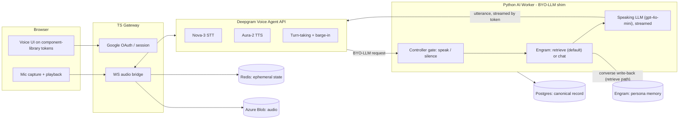
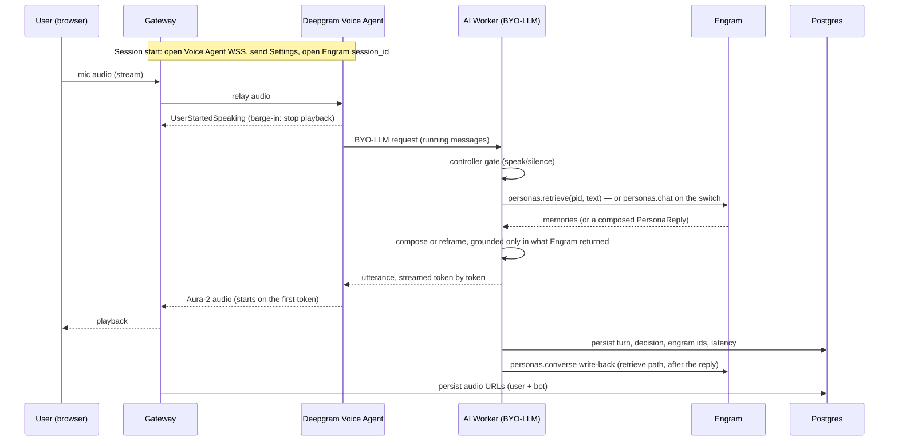

# TRD — Voice Persona Bot

Technical Requirements & Design. This is the source of truth for **how** the system is built. Owner: Tauqueer. Why a choice was made: [decisions/](decisions/README.md). Snapshot: [CONTEXT.md](CONTEXT.md). Map: [README.md](README.md). Companions: [PRD](PRD.md), [ENGRAM](ENGRAM.md), [current work](PHASE_6_PLAN.md), [personas](PHASE_5_PLAN.md), [index](PHASE_PLAN.md).

---

## 1. Locked decisions

Every decision below is confirmed. Do not silently change any of them; if reality forces a change, raise it with the owner, write a new record under [decisions/](decisions/README.md) that supersedes the old one, and update this section.

### 1.1 Product

- Custom persona bot; **the local catalog can store many personas**. Members see published rows and must pin one to talk (same picker on chat, voice, dashboard history, and the owner conversation list). Memory is per (user, persona). Persona content and TTS voice are owner-chosen. User-created personas stay parked.
- **Many independent, isolated users** (2-3 testers now, productionize later).
- Channel: **browser mic** (WebRTC/MediaRecorder), playback in browser.
- **Full-duplex with barge-in from Phase 2** (interruptions on).
- Language: **English (Nova-3) first**; `language=multi` code-switch is a later phase.
- Latency: **compose full reply, then speak**; ~2-2.5s/turn acceptable for the first build.
- The bot may **speak or stay silent/wait**; decision is model/signal driven (see 1.5).

### 1.2 Brain & memory (Engram)

- **Engram is the brain and the memory.** Which Engram call answers a turn is now config (`BRAIN_MODE`), and both paths keep memory in Engram:
  - **`chat`.** One `personas.chat` per turn; it retrieves shared + caller-private, grounds, and returns the reply, and writes the caller's private pool itself. Measured ~11s of Engram-side generation per turn.
  - **`retrieve` (default).** One `personas.retrieve` per turn (~0.7-1.5s); the answer model composes the reply from those memories under the same fact lock, and `personas.converse` writes both sides of the turn back to the caller's private pool off the reply path. Measured ~2.5s to first word, ~4s on a live spoken call.
  The controller gates speak/silence on whichever result comes back. `retrieve` became the default after a side-by-side run (`npm run brains`) showed it equal or better on memory recall, private recall, conversational continuity and refusing to invent when memory does not cover the question — at a quarter of the latency. `chat` remains available as a switch.
- **The speaking LLM** (config-pluggable, default `gpt-4o-mini`) always runs, streamed so speech starts on the first token. It sees the last N turns plus persona voice rules, and is **fact-locked** in both modes: it may not introduce facts beyond what Engram returned (minor connective phrasing only).
  - Under `chat` it is the **reframer**: it paraphrases Engram's composed reply.
  - Under `retrieve` it is the **answerer**: it composes the reply from the retrieved memories, which are then its only permitted source of facts.
- Persona identity = **Engram shared pool** (`teach` / `answer` / document ingest) **+** app voice rules in the reframe prompt.
- Pools: **persona shared + per-(user, persona) private**. **One Engram `session_id` per sitting** (one Postgres session with that persona on one channel). A later sitting mints a new thread id; long-term recall is the private pool, not that thread. Chat and voice do not share one Engram `session_id`. The caller's private pool is written by `chat` automatically, or by `converse` on the `retrieve` path. Do not write product chats into `{org}:{user}`.
- **Text-only into Engram** (audio is never sent to Engram).
- **Engram down = product down** for the first build.

### 1.3 Data stores

- **Redis:** ephemeral operational state only — session-id map, turn/VAD state, barge-in / TTS-cancel flags, interim-STT assembly. Never the source of conversational context.
- **Postgres:** canonical source of truth — turns, timestamps, latency spans, controller decisions, Engram ids, audio URLs.
- **Azure Blob (from day 1):** raw audio for **both** user input and bot TTS output; URLs stored in Postgres.
- Engram may compress/forget on its own; Postgres keeps the full record.

### 1.4 Voice transport

- **Default sitting (no Fish voice id):** **Deepgram Voice Agent API** (single WebSocket: Nova-3 STT + Aura-2 TTS + turn-taking + barge-in) with a **bring-your-own-LLM (BYO-LLM) shim** = controller -> Engram (`retrieve` by default, `chat` on the switch) -> the speaking LLM, streamed back token by token so speech starts on the first words. **Deepgram down = session ends** (+ reconnect attempt).
- **TTS is a property of the persona** (`personas.voice_config`). A dedicated env-named key holds a hosted **Fish Audio** voice id when the owner cloned or pasted one. The existing Deepgram key holds an Aura id; `DEEPGRAM_TTS_VOICE` is fallback when that Deepgram key is empty. Selection is “is the Fish key a non-empty string,” never id-format sniffing. Fish sittings fail closed on missing key / 401 / 402 — they do not fall back to Aura.
- **Fish sitting (Fish voice id set):** Deepgram **listen** streaming WSS (same STT model/language/endpointing as config) + hosted Fish TTS WebSocket (`reference_id`, PCM at the configured output sample rate) + our barge-in (flush playback and abort Fish). Voice Agent cannot speak a Fish id. The worker brain is unchanged. Fish clone bytes never go to Engram.
- **Historical fallback:** a custom split pipeline (separate Deepgram STT WSS + Aura TTS WSS + our own turn-taking/barge-in) was documented if Voice Agent could not host Engram-as-brain. Latency was resolved inside the brain instead; Aura sittings still use Voice Agent. The Fish sitting reuses that split shape with Fish in place of Aura TTS.

### 1.5 Controller

- Phase-1 scope: **speak vs silence**, plus reply hints. More decisions (safety, end-session, handoff) later.
- **No keyword matching / intent heuristics.** The decision derives from the Engram result (a composed reply on `chat`, retrieved memories on `retrieve`) and structured signals, never from string matching. Output is a small structured object (action + reason codes + optional hints).

### 1.6 Platform

- Frontend: **reuse the existing component library** (React 18 + Vite + Tailwind design tokens) + new voice UI.
- Stack: **TypeScript gateway** (web + WS bridge + auth) + **Python AI worker** (Engram SDK + reframe).
- Local Docker Compose now -> Azure later. Azure Blob is used from day 1.
- Auth: **Google OAuth / OIDC**, mapped to Engram `user_id` only after waitlist approval (owners auto-approved). **Hard per-user isolation is mandatory.** Daily turn and voice-minute caps are enforced before the brain spends for members (`OWNER_EMAILS` are not capped); a retried think reuses `write_receipts`.
- **Lightweight turn-level tracing** (structured logs + durations). GDPR-light: consent at sign-in for the current privacy/terms versions, export-my-data, delete-my-data (owners cannot be deleted), ended-session retention. No formal certification.

---

## 2. Architecture

### 2.1 Shipping architecture (Voice Agent API path)

### 2.2 Turn lifecycle (Voice Agent API path)

### 2.3 Component responsibilities

- **Frontend (`frontend/`):** landing and Google sign-in at `/`; signed-in personal app at `/dashboard` (chat, voice, own history); owner ops at `/admin`. Built on component-library tokens; the gallery stays in `Desktop/component-library`, not in this repo.
- **Gateway (`gateway/`, TypeScript):** Google OAuth + session; the client WebSocket; the bridge to the Deepgram Voice Agent WSS (Settings, audio relay both ways, event handling incl. barge-in); writing audio to Azure Blob and Redis ephemeral state. Holds no persona logic.
- **AI Worker (`worker/`, Python):** the **BYO-LLM endpoint** Deepgram calls. Runs the controller gate, the Engram call selected by `BRAIN_MODE`, and the speaking LLM, streaming the reply back as it is produced. Owns the Engram client wrapper and writes canonical turn records to Postgres. This is where the brain lives and where the fallback pipeline would plug in.

### 2.4 Split pipeline (Fish sittings, and the unused Aura fallback)

When the sitting’s persona has a Fish voice id, the gateway speaks to a Deepgram **STT streaming WSS** and a **Fish TTS WebSocket**, and implements turn-taking (endpointing + interim results) and barge-in (user started speaking → abort Fish + flush playback). The worker brain is unchanged.

The same split shape with **Aura TTS WSS** was the documented fallback if Voice Agent could not host Engram-as-brain. That Aura fallback was never needed; Aura sittings stay on Voice Agent.

---

## 3. Engram integration contract

Authoritative docs: <https://engram-docs-alpha.netlify.app/llms.txt>, personas: <https://engram-docs-alpha.netlify.app/sdk/personas>, isolation: <https://engram-docs-alpha.netlify.app/concepts/persona-memory>.

Rules the worker MUST follow:

- **Never build tenant strings by hand.** Use persona endpoints. A three-segment `{org}:{persona}:{user}` tenant is refused on generic routes by design.
- **Client shape:** `EngramClient(org_id, user_id, api_key=...)`. Each end user maps to one Engram `user_id`. Personas are Engram personas under one product org. **Never put product chats in `{org}:{user}` personal ingest** — chats go through persona endpoints into `{org}:{persona}:{user}`. Shared teach goes to `{org}:{persona}`. Full map: [ENGRAM.md](ENGRAM.md).
- **Reply path (`BRAIN_MODE=retrieve`, default):** `engram.personas.retrieve(pid, query, top_k=...)` returns `{"results": [...], "tenants": [...]}`. Read `text` and `tenant` off **each row** (not the top-level `tenants` list). Those texts are the only permitted source of facts for the answer. `top_k` matters: at 10 the answers came out noticeably thinner than at 25.
- **Reply path (`BRAIN_MODE=chat`):** `reply = engram.personas.chat(pid, message, session_id=sid)`. The SDK (`engram-ai-sdk` 0.4.0) returns `PersonaReply` with **`messages: list[str]`** (1–3 texting-style bubbles), `memories_used`, `session_id`, and `raw`. There is **no `reply.text`**. Flatten `messages` into one utterance (join order = list order; separator from config) before the reframe and before sending speech. Persist both the raw `messages` list and the flattened string.
- **Session id:** carry one conversation id for the whole conversation — omitting it makes the persona amnesiac. The app claims it (`uuid4().hex`, which is what the SDK mints too) when a session first needs one, so two turns starting at once share a thread instead of minting one each. Engram treats it as an opaque caller-chosen key.
- **No streaming:** `chat` is a single blocking call; the SDK exposes no token stream. Nothing downstream can start before it returns, which is why it costs the whole turn.
- **Seeding (admin):** `personas.create(name, handle=..., description=...)`; teach via `personas.teach(pid, text)` and `personas.answer(pid, question_key, text)` (question bank from `personas.questions(pid)`); ingest documents into the shared pool via `personas.shared(pid).document(...)`. Subscribe testers by joining People (`members.add`) then `personas.subscribe(pid, user_id)` — chatting without a subscription returns 403.
- **Writes:** on `chat`, Engram writes the caller's private pool automatically (both user turn and reply). On `retrieve`, the app writes both sides with `personas.converse(pid, text, session_id=..., speaker=...)` **after** the reply has been delivered, on a small thread pool so it never holds the reply open. Written turns are retrievable immediately. Never blind-retried; a failed write-back is logged and dropped.
- **Subscriptions:** Engram docs require an active subscription for chat (403 otherwise). Live subscribe needs `org:manage`; `members.add` needs `members:manage`. First talk joins People by Google email, persists Engram’s `user_id`, then subscribes that persona, then talks as that id. Fail closed if join or subscribe fails (except already subscribed). App published list is who may see a persona. Gateway mints a placeholder `engram_user_id` at admit; the worker replaces it with Engram’s id on first join. See [ENGRAM.md](ENGRAM.md) §4. The private tenant `{org}:{persona}:{user}` is the intended isolation boundary but is **not** honoured by the conversation endpoints today — [ENGRAM.md](ENGRAM.md) §2.3.
- **Consent:** we send text only, so audio/video/FER consent flags do not apply. Do not send audio to Engram.
- **Request logs:** `engram.insights.logs(limit=...)` is org-scoped (`GET /orgs/{org}/logs`, SDK `EngramClient(org_id)` / empty `user_id`). Rows are metadata only. `result` distinguishes a refusal (`denied`) from a fault (`error`). The call is gated by `audit:read`; a 403 is reported as `SKIP` by `npm run budgets`, not treated as a product outage.
- **Errors:** handle the documented taxonomy (401/402/403/404/409/422/5xx). Reads may retry on 429/502/503/504; **writes are never blind-retried**. Set client `timeout` generously.
- **Latency reality:** Engram is alpha; `chat` latency is unknown and may be slow. Mitigate with session-open-at-call-start and a thinking cue; if unworkable under the Voice Agent API, trip the fallback.

---

## 4. Deepgram integration

Authoritative docs: <https://developers.deepgram.com/>. Voice Agent message flow: <https://developers.deepgram.com/docs/voice-agent-message-flow>.

- **Voice Agent API:** open WSS, wait for `Welcome`, send `Settings` (audio format, Nova-3 STT `en`, Aura-2 voice, BYO-LLM config pointing at the worker), wait for `SettingsApplied`, then stream audio. Handle events: `UserStartedSpeaking` (stop playback for barge-in), `ConversationText`, `AgentThinking`, binary audio, `AgentAudioDone`, `Error`/`Warning`.
- **BYO-LLM reachability:** Deepgram calls the worker's BYO-LLM endpoint server-to-server, so it must be publicly reachable. Local dev uses a tunnel (ngrok/cloudflared); Azure uses a public endpoint. The endpoint speaks the configured OpenAI-compatible protocol and internally runs controller -> `chat` -> reframe.
- **Turn-taking config:** English conversational endpointing ~300ms. Code-switch (later) prefers ~100ms endpointing; treat these as config, not code branches.
- **Split pipeline specifics:** STT streaming with `interim_results=true` and `endpointing`; reconstruct utterances from `is_final`/`speech_final`; Fish TTS over WebSocket (PCM) when the persona has a Fish voice id, otherwise Aura TTS over WSS if that unused fallback is ever turned on; barge-in via abort/Clear + local playback flush.

Only non-language-understanding thresholds (endpointing ms, timeouts) are configured. No keyword logic anywhere in the pipeline.

---

## 5. Data model (Postgres, canonical)

Tables exist (Phase 1 migrations, extended in Phase 2). All ids/keys configurable; no hardcoded values.

- `users` — app user id, Google subject, email, mapped Engram `user_id` (the app UUID as 32 hex characters, no hyphens), timestamps. A `users` row is membership; it is created only after owner approval (or for `OWNER_EMAILS`).
- `access_requests` — Google subject + email admission queue: `requested` → `approved` → `active`, plus `denied` / `revoked`. Unapproved sign-in writes or refreshes a `requested` row and does not create a `users` row or an Engram pool.
- `personas` — local catalog of an Engram persona (Engram `persona_id`, handle, display name, voice config including TTS id, **published**). Talk, memory, and history look up a published row by id; missing or unpublished is the same 404 as a missing session. `ENGRAM_PERSONA_ID` is seed-only when the table is empty.
- `subscriptions` — mirror of Engram subscribe for admin visibility. Not the isolation control. Subscribe on first talk.
- `sessions` — a voice/chat session: app session id, user id, persona id, **Engram `session_id`**, channel, started/ended.
- `turns` — one row per turn: session id, ordinal, speaker (user/persona), text, STT/TTS metadata, controller decision + reason codes, `brain_mode` (which brain answered, so an A/B run is readable from SQL), `correlation_id` (the same id as the gateway and worker log lines for that turn; added in `infra/migrations/0005_correlation_id.sql`; nullable on rows written before that), created_at.
- `write_receipts` — one persist + converse write-back per `(session_id, correlation_id)` so a retried think does not double-record.
- `quota_settings` — at most one row. Daily turn and voice-minute caps, timezone, and warn ratio as set from the owner admin Overview. Env values are the fallback until that row exists.
- `ops_events` — operator alerts: service (`gateway` / `worker`), failure code, message, optional `correlation_id`. No user text. Written best-effort when a recorded dependency fails, or by the watch probe's forced row. Owner Overview on `/admin` shows the full list. Public `/status` (unauthenticated `GET /api/status`) shows live health under product labels and recent incidents without `correlation_id`, service tokens, or probe (`ops_forced`) rows.
- `consents` — one row per Google subject: current privacy and terms versions plus accepted-at. Existing members were backfilled as version `1`. Survives account delete so a later sign-in does not re-prompt until versions bump.
- `deletion_requests` — `pending` / `completed` / `cancelled`. Member self-delete or owner complete wipes app rows; `user_id` is set null when the user row goes. `access_requests` stays `active` so re-sign-in provisions a new empty user.
- `memory_refs` — Engram gids/tenants referenced or produced by a turn (for audit/debug).
- `audio_assets` — per turn/direction: Azure Blob URL, duration, format, size. Written only when `VOICE_AUDIO_PERSIST_ENABLED` is on and the storage keys are set; off until there is a storage account.
- `latency_spans` — per turn: `stt_ms`, `brain_ms` (the Engram call), `reframe_ms`, `reframe_first_token_ms` (when speech could start), `tts_first_byte_ms`, `total_ms`, and `transport_latency` holding the transport's own breakdown. That breakdown arrives as several single-field messages per turn and is merged before it is written.

Redis keys (ephemeral, TTL'd): active session map (kinds `member` / `waitlist` / `refused` / `consent`), current turn state, barge-in/cancel flags, interim-STT assembly buffer. The voice notice Redis channel also carries a trace payload after a turn is recorded so the gateway can log the voice correlation id; that payload is log-only and is never sent to the caller.

Ended sessions older than `RETENTION_SESSION_DAYS` (config; `0` is off) are deleted by `npm run retain` or an optional gateway sweep. Open sessions are never retained. Audio blob delete is a no-op until archiving is on. Engram private-pool purge uses the org persona admin surface (`user_memories` / `forget_user_memory` / `unsubscribe`) and is skipped when Engram keys are unset.

---

## 6. Tech stack & tooling

- **Frontend:** React 18, Vite, Tailwind 3, TypeScript (from the existing component library). Biome. Vite `envDir` is the repo root so only `VITE_*` keys from `.env` reach the browser.
- **Gateway:** TypeScript (Node 22). Plain Fastify + `@fastify/websocket` + `@fastify/cors`. `postgres` (postgres.js), **ioredis**, `@azure/storage-blob`, pino, dotenv, Zod. Google Sign-In is a small fetch util (Part 1.3), not Passport/`openid-client`.
- **Worker:** Python 3.12, uv. FastAPI + uvicorn, `engram-ai-sdk`, OpenAI SDK, `psycopg[binary,pool]`, pydantic-settings, structlog, Ruff. The database pool, the Engram clients (one per user, LRU) and the OpenAI client are built once per process and reused across turns.
- **Config:** one root `.env` / `.env.example`. Gateway Zod and worker pydantic-settings fail on boot if required keys are missing or invalid.
- **Infra:** Docker Compose (Postgres, Redis, gateway, worker, frontend). Azure Blob external. Dev tunnel for BYO-LLM reachability.
- **Quality:** Biome (TS), Ruff (Python); structured logging; lightweight turn tracing.

---

## 7. Non-functional requirements

- **Isolation:** a user can never read another user's conversation, and a member's Ada history is not their Nova history. The app never forges tenants and refuses a session whose stored user / persona / Engram ids do not match. Subscribe is not the isolation control. Mandatory. **App-side and Engram-side both hold as of 8 Sep 2026, and both are probed.** The persona conversation endpoints resolve the private pool from the authenticated principal; we used to call them with one org API key, so every member shared the key owner's pool. Each member now authenticates with their own session token from `auth.login`, so their turns land in `{org}:{persona}:{member}`. A member we cannot credential degrades to shared-only rather than falling back to the key owner. See [ENGRAM.md](ENGRAM.md) §2.3 and [ENGRAM_PRIVATE_ROLLOUT.md](ENGRAM_PRIVATE_ROLLOUT.md).
- **Latency:** ~2-2.5s/turn target for the first build; capture per-stage spans; a thinking cue masks brain latency. Measured to first spoken word: **~2.5-4s on the default `retrieve` brain**, against ~12.5s on `chat` (of which ~11s is Engram-side generation we do not control).
- **Reliability:** Engram down = product down (honest messaging). Deepgram down = session ends + reconnect. Blob storage down = the call continues, logged and surfaced to the client as a warning — it is a secondary record, not the product. Handle Engram error taxonomy; never blind-retry writes.
- **Security:** secrets stay server-side. Only `VITE_*` keys reach the browser (`frontend/src/vite-env.d.ts` is the allow-list; `/api/me` returns `id`, `email`, `owner` — not `engram_user_id` or `google_sub`). The session cookie is httpOnly, signed, SameSite from `SESSION_COOKIE_SAMESITE`; `SESSION_COOKIE_SAMESITE=none` refuses to boot unless the cookie is Secure (`SESSION_COOKIE_SECURE=true` or `NODE_ENV=production`). CORS is `FRONTEND_ORIGIN` with credentials. Gateway→worker calls send `INTERNAL_API_SECRET`; the worker compares with `secrets.compare_digest` and returns 401 without it. The think endpoint is public by design and still refuses missing/wrong secrets (401) and forged identity / stolen sessions (403); those refusals are logged. The same identity match guards the memory panel: `/internal/memories` requires the app user id and re-verifies the stored Engram mapping (403 on mismatch), so a valid internal secret alone can never read another user's pool. The gateway rate-limits every request per client address (Redis-backed, fails open); the worker throttles repeated internal-secret failures per client address (429 over `INTERNAL_AUTH_MAX_FAILURES` within `INTERNAL_AUTH_FAILURE_WINDOW_SECONDS`), which caps unauthenticated abuse of the public think endpoint without throttling legitimate server-to-server traffic (a correct secret is never counted). In production the frontend stays same-site with the gateway, so `SameSite=lax` holds and no separate CSRF token is needed, and the worker's `/internal/*` routes become gateway-only (private ingress), leaving only the think path publicly reachable (see [FUTURE.md](FUTURE.md) Plan X Azure). Worker OpenAPI (`/docs`, `/redoc`, `/openapi.json`) is off unless `WORKER_OPENAPI_ENABLED=true`. Every turn row joins a session that has a `user_id` (`infra/migrations/0002_core.sql`). Cross-user reads of `/api/me/sessions/:id` and `/api/chat` return the same 404 as a missing row and are logged. Non-owners hitting `/api/admin/*` get 403 and a warning log. `npm run isolation` and `npm run security` encode this. Isolation is the app's session-ownership and identity match, plus Engram's persona pools ([ENGRAM.md](ENGRAM.md)). A brand-new Google OAuth click-through has not been done in a browser; isolation is proven with two real Google-mapped users via signed cookies.
- **Observability:** structured logs plus a per-turn correlation id on the stored row. Typed chat mints the id in the gateway and sends it on `CORRELATION_ID_HEADER`. Voice mints it on the worker (Deepgram does not forward a per-turn header) and the gateway logs it from the Redis trace notice. Log fields are an allow-list (`LOG_TURN_FIELDS`); transcript text is omitted unless listed. The think request log takes `session_id` from that allow-list only — passing it again as a keyword crashes the turn (HTTP 500, Deepgram `FAILED_TO_THINK`). `npm run budgets` compares recent p50/p90 time-to-first-word per stored `brain_mode` to config and reviews Engram `insights.logs` for denials and errors. The check never changes call behaviour. The admin reconstruct shows the id; the personal spoken transcript does not. Dependency failures listed in `OPS_RECORD_CODES` are also stored in `ops_events` (best-effort, never fail the caller) with that correlation id when present. `/health` stays a liveness ping. Owner Overview shows live health (same banner and system list as `/status`) plus dated alerts with codes and correlation ids. Public `/status` (unauthenticated `GET /api/status`) shows the same live checks under product labels, plus past incidents (no correlation ids, no probe rows). `npm run observe` writes a forced row and reads it back. No Sentry or outbound alert channel yet.

---

## 8. Risks & mitigations

- **Engram alpha latency vs Voice Agent LLM wait window** — *resolved without changing transport.* `chat` cost ~11s per turn, and Deepgram warns `SLOW_THINK_REQUEST` every 5s while waiting (it does not drop the call). Measured `retrieve` at 0.7–1.5s against `chat` at ~10.6s, so the default brain now reads memory and composes here; the reply is streamed so speech starts on the first token. The thinking cue covers what remains. The custom-pipeline fallback was never needed.
- **BYO-LLM public reachability in local dev** — `BYO_LLM_PUBLIC_URL` is a tunnel (or public worker URL) Deepgram can call; see [SHIPPED.md](SHIPPED.md).
- **Engram alpha API churn** — client wrapped behind an interface; pin SDK; watch changelog.
- **Barge-in correctness** — rely on Voice Agent `UserStartedSpeaking`; in fallback, pair `Clear` with playback flush (doing only one causes stalls). The drop must also be cleared when a *new* agent turn starts: an interrupted utterance may never report its end, and latching on that alone can mute the rest of the call.
- **Persona voice drift / hallucination** — the speaking LLM is fact-locked to whatever Engram returned, on both brains; persona identity seeded in the shared pool. On `retrieve` the app owns more of the answer, so this is the thing to keep watching: a side-by-side run confirmed it declines rather than invents when memory does not cover a question, and `npm run brains` re-runs that check.

---

## 9. Future improvements (post first build)

See [FUTURE.md](FUTURE.md) for parked product and Plan X. Cloned voices and member UI are **current** work ([PHASE_6_PLAN.md](PHASE_6_PLAN.md)). Multi-persona is built ([PHASE_5_PLAN.md](PHASE_5_PLAN.md)).
