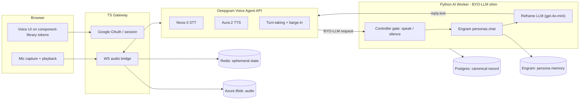
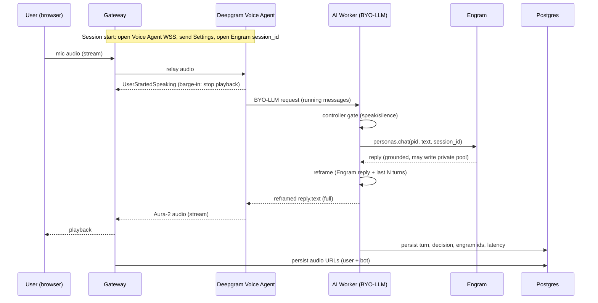

# TRD — Voice Persona Bot

Technical Requirements & Design. This is the source of truth for **how** the system is built. Owner: Tauqueer. Companion documents: [PRD](PRD.md), [Phase Plan](PHASE_PLAN.md).

---

## 1. Locked decisions

Every decision below is confirmed. Do not silently change any of them; if reality forces a change, raise it with the owner and update this section.

### 1.1 Product

- Custom persona bot; **one seeded persona** for the first build (a historical figure). Persona content/voice is owner-chosen.
- **Many independent, isolated users** (2-3 testers now, productionize later).
- Channel: **browser mic** (WebRTC/MediaRecorder), playback in browser.
- **Full-duplex with barge-in from Phase 2** (interruptions on).
- Language: **English (Nova-3) first**; `language=multi` code-switch is a later phase.
- Latency: **compose full reply, then speak**; ~2-2.5s/turn acceptable for the first build.
- The bot may **speak or stay silent/wait**; decision is model/signal driven (see 1.5).

### 1.2 Brain & memory (Engram)

- **Engram `personas.chat` is the brain.** One `chat` call per user turn; it retrieves shared + caller-private, grounds, and returns the reply. The controller gates speak/silence on its result. We do **not** make a separate `retrieve` call per turn.
- **Reframe LLM** (config-pluggable, default `gpt-4o-mini`) always runs. It sees the **Engram reply + last N turns** plus persona voice rules. It is **paraphrase/fact-locked**: it may not introduce facts beyond Engram's reply (minor connective phrasing only).
- Persona identity = **Engram shared pool** (`teach` / `answer` / document ingest) **+** app voice rules in the reframe prompt.
- Pools: **shared + per-user private** (Engram default). **One Engram `session_id` per voice session**, threaded. Rely on `chat` auto-writing the caller's private pool; selective salient-fact ingest is deferred.
- **Text-only into Engram** (audio is never sent to Engram).
- **Engram down = product down** for the first build.

### 1.3 Data stores

- **Redis:** ephemeral operational state only — session-id map, turn/VAD state, barge-in / TTS-cancel flags, interim-STT assembly. Never the source of conversational context.
- **Postgres:** canonical source of truth — turns, timestamps, latency spans, controller decisions, Engram ids, audio URLs.
- **Azure Blob (from day 1):** raw audio for **both** user input and bot TTS output; URLs stored in Postgres.
- Engram may compress/forget on its own; Postgres keeps the full record.

### 1.4 Voice transport

- **Deepgram Voice Agent API** (single WebSocket: Nova-3 STT + Aura-2 TTS + turn-taking + barge-in) with a **bring-your-own-LLM (BYO-LLM) shim** = controller -> `personas.chat` -> reframe.
- One fixed Aura-2 voice (clone later). **Deepgram down = session ends** (+ reconnect attempt).
- **Fallback:** a custom split pipeline (separate Deepgram STT WSS + Aura TTS WSS + our own turn-taking/barge-in) is used **only if** the Voice Agent API cannot acceptably host Engram-as-brain. The brain is written behind an interface so the swap is clean.

### 1.5 Controller

- Phase-1 scope: **speak vs silence**, plus reply hints. More decisions (safety, end-session, handoff) later.
- **No keyword matching / intent heuristics.** The decision derives from the Engram `chat` result and structured signals, never from string matching. Output is a small structured object (action + reason codes + optional hints).

### 1.6 Platform

- Frontend: **reuse the existing component library** (React 18 + Vite + Tailwind design tokens) + new voice UI.
- Stack: **TypeScript gateway** (web + WS bridge + auth) + **Python AI worker** (Engram SDK + reframe).
- Local Docker Compose now -> Azure later. Azure Blob is used from day 1.
- Auth: **Google OAuth / OIDC**, mapped to Engram `user_id`. **Hard per-user isolation is mandatory.**
- **Lightweight turn-level tracing** (structured logs + durations). Consent/compliance deferred.

---

## 2. Architecture

### 2.1 Shipping architecture (Voice Agent API path)

### 2.2 Turn lifecycle (Voice Agent API path)

### 2.3 Component responsibilities

- **Frontend (`frontend/`):** sign-in, mic capture + playback, voice UI (mic states, live transcript, waveform/VU, persona listening/thinking/speaking states), minimal persona admin screen. Built on the existing component-library tokens/primitives.
- **Gateway (`gateway/`, TypeScript):** Google OAuth + session; the client WebSocket; the bridge to the Deepgram Voice Agent WSS (Settings, audio relay both ways, event handling incl. barge-in); writing audio to Azure Blob and Redis ephemeral state. Holds no persona logic.
- **AI Worker (`worker/`, Python):** the **BYO-LLM endpoint** Deepgram calls. Runs the controller gate, Engram `personas.chat`, and the reframe LLM. Owns the Engram client wrapper and writes canonical turn records to Postgres. This is where the brain lives and where the fallback pipeline would plug in.

### 2.4 Fallback architecture (custom pipeline)

Only if the Voice Agent API cannot host Engram-as-brain acceptably (e.g. its LLM wait window is too tight for Engram alpha + reframe): the gateway instead speaks to a Deepgram **STT streaming WSS** and an **Aura TTS WSS** directly, and the worker/gateway implement turn-taking (endpointing + interim results) and barge-in (`UserStartedSpeaking` -> `Clear` to TTS + flush playback) themselves. The worker brain is unchanged because it sits behind an interface.

---

## 3. Engram integration contract

Authoritative docs: <https://engram-docs-alpha.netlify.app/llms.txt>, personas: <https://engram-docs-alpha.netlify.app/sdk/personas>, isolation: <https://engram-docs-alpha.netlify.app/concepts/persona-memory>.

Rules the worker MUST follow:

- **Never build tenant strings by hand.** Use persona endpoints. A three-segment `{org}:{persona}:{user}` tenant is refused on generic routes by design.
- **Client shape:** `EngramClient(org_id, user_id, api_key=...)`. Each end user maps to one Engram `user_id`; the persona is one Engram persona under one product org.
- **Reply path:** `reply = engram.personas.chat(pid, message, session_id=sid)`. Use `reply.text` (flatten the 1-3 bubbles into one utterance). Carry `reply.session_id` forward for the whole conversation — omitting it makes the persona amnesiac.
- **Reads:** if the controller ever needs raw memory, use `engram.personas.retrieve(pid, query)` and read `tenant` off each row (not the top-level `tenants` list). Not used on the default per-turn path.
- **Seeding (admin):** `personas.create(name, handle, description=...)`; teach via `personas.teach(pid, fact)` and `personas.answer(pid, key, text)` (question bank from `personas.questions(pid)`); ingest documents into the shared pool via `personas.shared(pid).ingest.document(...)`. Subscribe testers with `personas.subscribe(pid, user_id)` — chatting without a subscription returns 403.
- **Writes on chat:** `chat` writes the caller's private pool automatically (both user turn and reply). No extra ingest in Phase 1/2.
- **Consent:** we send text only, so audio/video/FER consent flags do not apply. Do not send audio to Engram.
- **Errors:** handle the documented taxonomy (401/402/403/404/409/422/5xx). Reads may retry on 429/502/503/504; **writes are never blind-retried**. Set client `timeout` generously.
- **Latency reality:** Engram is alpha; `chat` latency is unknown and may be slow. Mitigate with session-open-at-call-start and a thinking cue; if unworkable under the Voice Agent API, trip the fallback.

---

## 4. Deepgram integration

Authoritative docs: <https://developers.deepgram.com/>. Voice Agent message flow: <https://developers.deepgram.com/docs/voice-agent-message-flow>.

- **Voice Agent API:** open WSS, wait for `Welcome`, send `Settings` (audio format, Nova-3 STT `en`, Aura-2 voice, BYO-LLM config pointing at the worker), wait for `SettingsApplied`, then stream audio. Handle events: `UserStartedSpeaking` (stop playback for barge-in), `ConversationText`, `AgentThinking`, binary audio, `AgentAudioDone`, `Error`/`Warning`.
- **BYO-LLM reachability:** Deepgram calls the worker's BYO-LLM endpoint server-to-server, so it must be publicly reachable. Local dev uses a tunnel (ngrok/cloudflared); Azure uses a public endpoint. The endpoint speaks the configured OpenAI-compatible protocol and internally runs controller -> `chat` -> reframe.
- **Turn-taking config:** English conversational endpointing ~300ms. Code-switch (later) prefers ~100ms endpointing; treat these as config, not code branches.
- **Fallback pipeline specifics:** STT streaming with `interim_results=true` and `endpointing`; reconstruct utterances from `is_final`/`speech_final`; Aura TTS over WSS; barge-in via `Clear` + local playback flush.

Only non-language-understanding thresholds (endpointing ms, timeouts) are configured. No keyword logic anywhere in the pipeline.

---

## 5. Data model (Postgres, canonical)

Indicative tables (finalized in Phase 1). All ids/keys configurable; no hardcoded values.

- `users` — app user id, Google subject, email, mapped Engram `user_id`, timestamps.
- `personas` — local reference to the Engram persona (Engram `persona_id`, handle, display name, voice config).
- `subscriptions` — which users are subscribed to the persona (mirrors Engram state for admin visibility).
- `sessions` — a voice/chat session: app session id, user id, persona id, **Engram `session_id`**, channel, started/ended.
- `turns` — one row per turn: session id, ordinal, speaker (user/persona), text, STT/TTS metadata, controller decision + reason codes, created_at.
- `memory_refs` — Engram gids/tenants referenced or produced by a turn (for audit/debug).
- `audio_assets` — per turn/direction: Azure Blob URL, duration, format, size.
- `latency_spans` — per turn: STT, brain (chat), reframe, TTS-first-byte, total.

Redis keys (ephemeral, TTL'd): active session map, current turn state, barge-in/cancel flags, interim-STT assembly buffer.

---

## 6. Tech stack & tooling

- **Frontend:** React 18, Vite, Tailwind 3, TypeScript (from the existing component library). Biome. Vite `envDir` is the repo root so only `VITE_*` keys from `.env` reach the browser.
- **Gateway:** TypeScript (Node 22). Plain Fastify + `@fastify/websocket` + `@fastify/cors`. `postgres` (postgres.js), **ioredis**, `@azure/storage-blob`, pino, dotenv, Zod. Google Sign-In is a small fetch util (Part 1.3), not Passport/`openid-client`.
- **Worker:** Python 3.12, uv. FastAPI + uvicorn, `engram-ai-sdk`, OpenAI SDK, `psycopg[binary]`, pydantic-settings, structlog, Ruff.
- **Config:** one root `.env` / `.env.example`. Gateway Zod and worker pydantic-settings fail on boot if required keys are missing or invalid.
- **Infra:** Docker Compose (Postgres, Redis, gateway, worker, frontend). Azure Blob external. Dev tunnel for BYO-LLM reachability.
- **Quality:** Biome (TS), Ruff (Python); structured logging; lightweight turn tracing.

---

## 7. Non-functional requirements

- **Isolation:** a user can never read another user's private pool; enforced structurally by Engram and by never forging tenants. Mandatory.
- **Latency:** ~2-2.5s/turn target for the first build; capture per-stage spans; a thinking cue masks brain latency.
- **Reliability:** Engram down = product down (honest messaging). Deepgram down = session ends + reconnect. Handle Engram error taxonomy; never blind-retry writes.
- **Security:** secrets server-side only; OAuth-gated; audit-friendly canonical store.
- **Observability:** structured logs + turn-level durations from day one of Phase 2.

---

## 8. Risks & mitigations

- **Engram alpha latency vs Voice Agent LLM wait window** — session-open early + thinking cue; fallback to custom pipeline; brain behind an interface.
- **BYO-LLM public reachability in local dev** — dev tunnel; documented in Phase 2.
- **Engram alpha API churn** — client wrapped behind an interface; pin SDK; watch changelog.
- **Barge-in correctness** — rely on Voice Agent `UserStartedSpeaking`; in fallback, pair `Clear` with playback flush (doing only one causes stalls).
- **Persona voice drift / hallucination** — reframe is fact-locked to Engram output; persona identity seeded in the shared pool.

---

## 9. Future improvements (post first build)

- Multilingual code-switching (`language=multi`) with tuned endpointing.
- Per-persona voice + voice cloning.
- Richer controller (safety filter, end-session, human handoff, tool use), still model/signal driven.
- Streaming TTS per sentence for sub-1.5s perceived latency.
- Selective salient-fact ingest and persona compression tuning.
- Multi-persona admin UI and multi-tenant SaaS shape.
- Consent, retention, delete-my-data, and usage/billing dashboards.
- Azure production hardening (managed Postgres/Redis, autoscaling, CI/CD).
